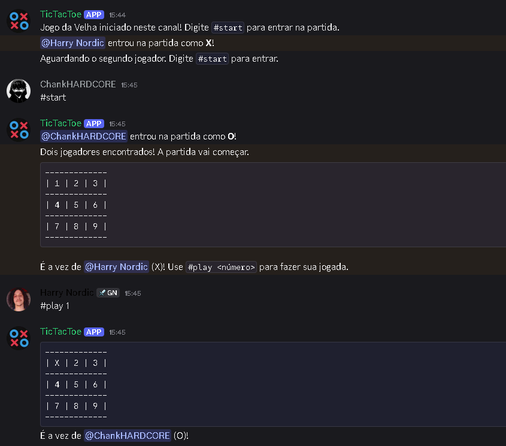

# Bot de Jogo da Velha para Discord

Um bot simples para Discord que permite que dois jogadores joguem Jogo da Velha (Tic-Tac-Toe) diretamente em um canal do Discord. Desenvolvido em Python com a biblioteca `discord.py`, este bot é ideal para demonstrar habilidades em desenvolvimento de bots, gerenciamento de estado e uso de variáveis de ambiente.

---

## Funcionalidades

* **`#start`**: Inicia uma nova partida de Jogo da Velha no canal. Dois jogadores precisam digitar este comando para entrar na partida.

* **`#play <posição>`**: Faz uma jogada no tabuleiro. Substitua `<posição>` por um número de `1` a `9` para escolher a casa desejada.

* **`#show`**: Exibe o tabuleiro atual e informa de quem é a vez.

* **`#stop`**: Encerra a partida atual.

* **`#language <idioma>`**: Permite mudar o idioma das mensagens do bot no canal (ex: `#language pt-br` ou `#language en-us`).

---

## Como Rodar o Bot

Siga estas instruções detalhadas para configurar e executar o bot em seu próprio servidor Discord.

### Pré-requisitos

* **Python 3.8+** instalado.

* Acesso ao [Discord Developer Portal](https://discord.com/developers/applications) para criar e configurar seu bot.

### Instalação das Dependências

1.  Clone este repositório para o seu computador:

    ```bash
    git clone [https://github.com/harrynordic/TicTacToe-DICORD-BOT.git](https://github.com/harrynordic/TicTacToe-DICORD-BOT.git)
    cd TicTacToe-DICORD-BOT
    ```

2.  Instale as bibliotecas Python necessárias usando `pip`:

    ```bash
    pip install discord.py python-dotenv
    ```

### Configuração do Token do Bot (Crucial!)

Para que o bot se conecte ao Discord, ele precisa de um token de autenticação. **Este token é secreto e nunca deve ser compartilhado publicamente em seu código ou repositório.**

1.  **Crie seu Bot no Discord Developer Portal:**

    * Acesse o [Discord Developer Portal](https://discord.com/developers/applications).

    * Crie uma nova aplicação e, em seguida, adicione um bot a ela.

    * **Copie o Token do seu Bot:** Na seção "Bot", clique em "Reset Token" e copie o token gerado.

    * **Habilite os Intents:** Na seção "Privileged Gateway Intents", ative **"MESSAGE CONTENT INTENT"**, **"PRESENCE INTENT"** e **"SERVER MEMBERS INTENT"**. Salve as alterações.

2.  **Crie o Arquivo `.env`:**

    * Na **pasta raiz** do seu projeto (a mesma onde está o arquivo principal do bot), crie um novo arquivo chamado **`.env`**.

    * Dentro do arquivo `.env`, adicione a seguinte linha, substituindo `YOUR_TOKEN_HERE` pelo token que você copiou:

        ```
        DISCORD_TOKEN=YOUR_TOKEN_HERE
        ```

    * **Importante**: O arquivo `.env` está configurado para ser ignorado pelo Git (via `.gitignore`) e **não será enviado para o GitHub**, mantendo seu token seguro.

### Adicione o Bot ao seu Servidor Discord

1.  No Discord Developer Portal, vá em "OAuth2" > "URL Generator".

2.  Em "SCOPES", marque a caixa `bot`.

3.  Em "BOT PERMISSIONS", selecione as permissões necessárias para o bot funcionar (ex: `Send Messages`, `Read Message History`, `Use External Emojis`, `Manage Messages`).

4.  Copie o URL gerado na parte inferior e cole-o no seu navegador para adicionar o bot ao seu servidor.

### Executando o Bot

1.  Abra um terminal ou prompt de comando na pasta do seu projeto.

2.  Execute o script Python do bot:

    ```bash
    python TicTacToe-Discord-Bot.py
    ```

3.  O bot deverá aparecer online no seu servidor Discord!

---

## Demonstração

Aqui está uma demonstração do bot em ação:



---

## Contato

Se tiver alguma dúvida, sugestão ou quiser se conectar, sinta-se à vontade para entrar em contato:

* **GitHub:** [harrynordic](https://github.com/harrynordic)

* **Email:** [miketsukami.shion@gmail.com](miketsukami.shion@gmail.com)

* **LinkedIn:** [harrynordic](https://www.linkedin.com/in/lucasharry/)